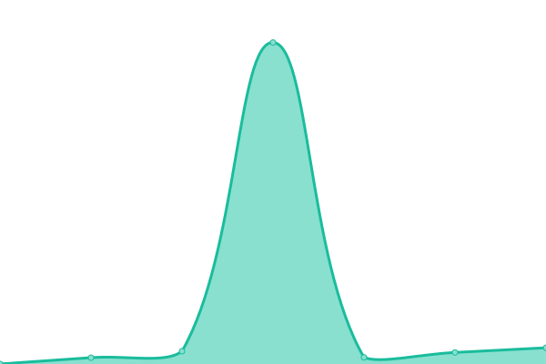
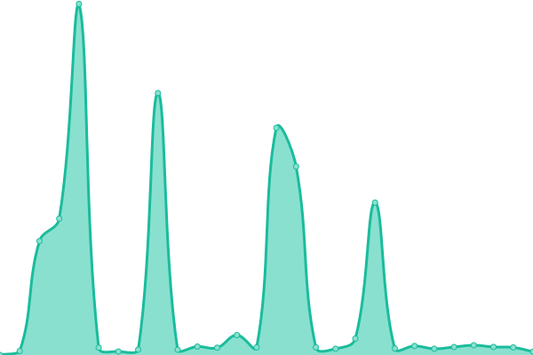
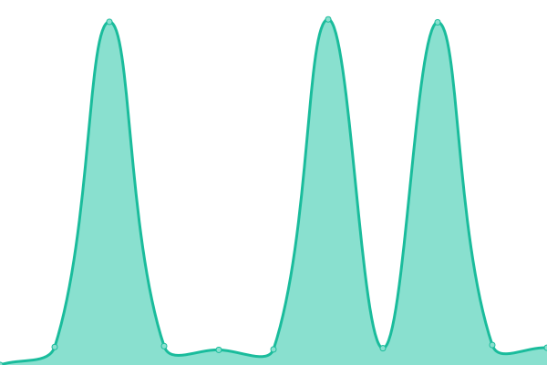
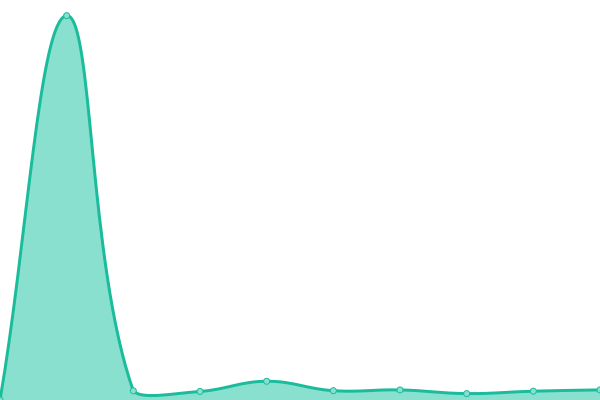
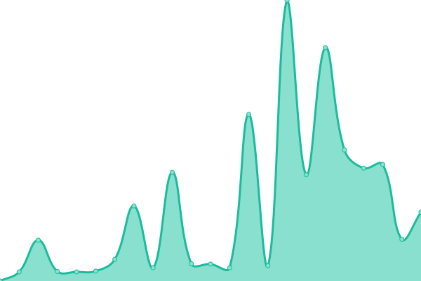

# [📈 Live Status](https://upptime.github.io/upptime): <!--live status--> **🟥 Complete outage**

This repository contains the open-source uptime monitor and status page for [Upptime](https://upptime.js.org), powered by [Upptime](https://github.com/upptime/upptime).

With [Upptime](https://upptime.js.org), you can get your own unlimited and free uptime monitor and status page, powered entirely by a GitHub repository. We use [Issues](https://github.com/upptime/upptime/issues) as incident reports, [Actions](https://github.com/Ikhwan Hadi/uptimevf/actions) as uptime monitors, and [Pages](https://upptime.github.io/upptime) for the status page.

<!--start: status pages-->
<!-- This summary is generated by Upptime (https://github.com/upptime/upptime) -->
<!-- Do not edit this manually, your changes will be overwritten -->
<!-- prettier-ignore -->
| URL | Status | History | Response Time | Uptime |
| --- | ------ | ------- | ------------- | ------ |
|  [PenyanyiVF Reborn](https://vfreborn.nexter32.repl.co) | 🟥 Down | [penyanyi-vf-reborn.yml](https://github.com/ikhwan32/uptimevf/commits/HEAD/history/penyanyi-vf-reborn.yml) | 

 0ms
     
 | 

<a href="https://ikhwan32.github.io/uptimevf/history/penyanyi-vf-reborn">0.00%</a>
    

|  [Penyanyi VF v3](https://discord-musicbot.nexter32.repl.co) | 🟥 Down | [penyanyi-vf-v3.yml](https://github.com/ikhwan32/uptimevf/commits/HEAD/history/penyanyi-vf-v3.yml) | 

 1787ms
     
 | 

<a href="https://ikhwan32.github.io/uptimevf/history/penyanyi-vf-v3">98.75%</a>
    

|  [Uptime VF Bot](https://uptime-discord-bot.nexter32.repl.co) | 🟥 Down | [uptime-vf-bot.yml](https://github.com/ikhwan32/uptimevf/commits/HEAD/history/uptime-vf-bot.yml) | 

 2779ms
     
 | 

<a href="https://ikhwan32.github.io/uptimevf/history/uptime-vf-bot">99.53%</a>
    

|  [Penyanyi VF V2](https://evobot-1.nexter32.repl.co) | 🟥 Down | [penyanyi-vf-v2.yml](https://github.com/ikhwan32/uptimevf/commits/HEAD/history/penyanyi-vf-v2.yml) | 

 1092ms
     
 | 

<a href="https://ikhwan32.github.io/uptimevf/history/penyanyi-vf-v2">99.70%</a>
    

|  [MusicBot UITM](https://MusicBot-UITM.nexter32.repl.co) | 🟥 Down | [music-bot-uitm.yml](https://github.com/ikhwan32/uptimevf/commits/HEAD/history/music-bot-uitm.yml) | 

 1484ms
     
 | 

<a href="https://ikhwan32.github.io/uptimevf/history/music-bot-uitm">99.10%</a>
    

<!--end: status pages-->

[**Visit our status website →**](https://upptime.github.io/upptime)

## 📄 License

- Powered by: [Upptime](https://github.com/upptime/upptime)
- Code: [MIT](./LICENSE) © [Upptime](https://upptime.js.org)
- Data in the `./history` directory: [Open Database License](https://opendatacommons.org/licenses/odbl/1-0/)
